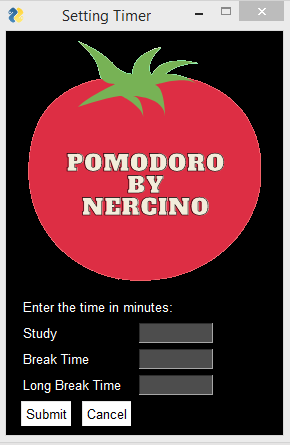
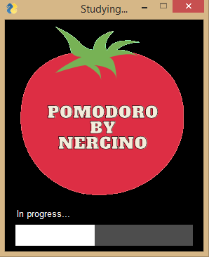
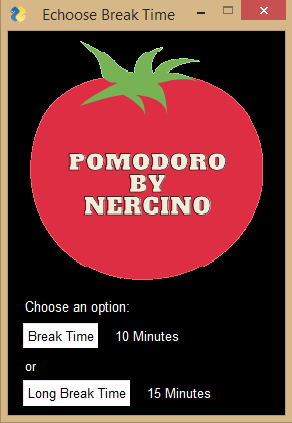
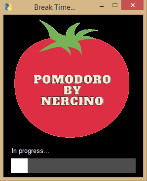

<h1 align="center">🍅 Pomodoro by Nercino 🍅</h1>

## 📝 Description:

- Simple program for Pomodoro Technique:


 

  

## 🔧 Technologies and Frameworks:
- Python;
- PySimpleGUI;
- PyAutoGUI
- Playsound;

## 🚀 Running the Project:

- ### Clone the repository:
```
git clone https://github.com/NercinoN21/python-pomodoro
```

- ### Enter the repository:
```
cd python-pomodoro
```

- ### Check the requirements:
```
pip install -r requirements.txt
```

- ### Run the APP:
```
python app/scripts/main.py
```

## ✅ Tests:

- ### Enter the repository:
```
cd python-pomodoro
```

- ### Run the commands:
```
python -m unittest -v app/test/test_pop_ups.py
```
```
python -m unittest -v app/test/test_setting_time.py
```
```
python -m unittest -v app/test/test_time_bar_data.py
```
```
python -m unittest -v app/test/test_time_bar.py
```